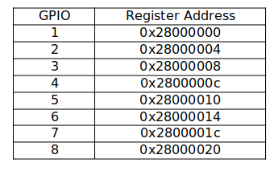

# Linux Kernel GPIO Driver: Register-Level Control
This project provides a Linux kernel module designed for direct, register-level control of a simulated General Purpose Input/Output (GPIO) hardware block.

- Register-Level Access: Directly manipulates the hardware memory map.
- Bidirectional Pin Control: Supports setting the pin direction as Input or Output (Direction Bit).
- Data Read/Write: Allows user-space applications to read the current state of an Input pin and set the output value of an Output pin (Data Bit).
- Interrupt Handling: Implements an interrupt handler to detect and process events from the GPIO hardware.
- Interrupt Management: Supports enabling and disabling interrupts per pin (Enable Bit) and clearing the interrupt status (Status Bit).
- User-Space Interface: Exposes all functionality via standard ioctl() commands over the /dev/gpio_drv character device.

## Hardware Specification
Supports a simulated 8-pin GPIO block, where each pin has a dedicated 32-bit register. The simulated GPIO registers are mapped starting at the physical base address 0x28000000.



Each 32-bit register is structured as follows:

<table> <tr> <th>Bits</th> <th>Name</th> <th>Description</th> </tr> <tr> <td style="background-color:#f0f0f0;">[31:10]</td> <td><b>Reserved</b></td> <td>Unused bits.</td> </tr> <tr> <td style="background-color:#e3f2fd;">[9]</td> <td><b>INT_ENABLE</b></td> <td>Interrupt Enable: 1 to enable interrupts for this pin; 0 to disable.</td> </tr> <tr> <td style="background-color:#e8f5e9;">[8]</td> <td><b>INT_STATUS</b></td> <td>Interrupt Status: Set to 1 by hardware upon an event; cleared by writing to it (Write-1-to-Clear mechanism).</td> </tr> <tr> <td style="background-color:#f0f0f0;">[2]</td> <td><b>Reserved</b></td> <td>Unused bits.</td> </tr> <tr> <td style="background-color:#fff3e0;">[1]</td> <td><b>DIRECTION</b></td> <td>Direction: 0 for Input, 1 for Output.</td> </tr> <tr> <td style="background-color:#fce4ec;">[0]</td> <td><b>DATA</b></td> <td>Data: Current input value (read) or desired output value (write).</td> </tr> </table>

## Repository Contents

gpio_driver.c: The main kernel module source code.

gpio_ioctrl.h: Header file defining IOCTL commands and the gpio data structure.

Makefile: Build instructions for the kernel module.

## Building and Usage

1. Use the provided Makefile to compile the module for your target system (or cross-compile for an embedded target like ARM).
   Inside the folder run:
   ```bash
   make
   ```

2. Load the module into the kernel. This creates the /dev/gpio_drv character device.
   ```bash
   sudo insmod gpio_driver.ko
   ```
   
3. Unload the module:
   ```bash
   sudo rmmod gpio_driver
   ```
